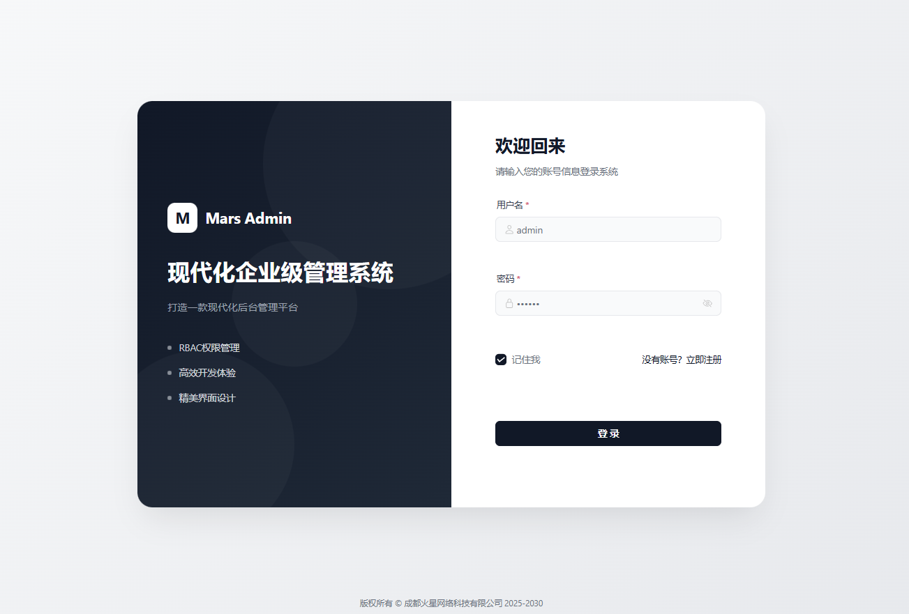
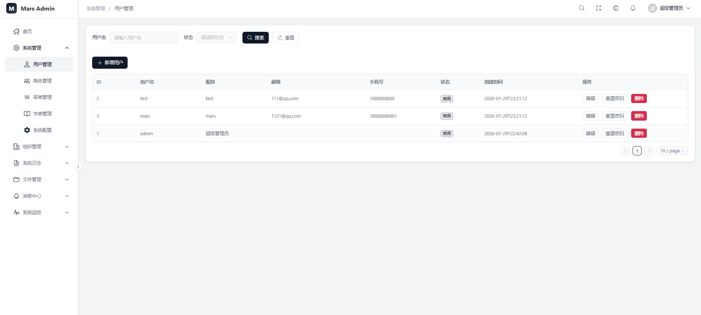
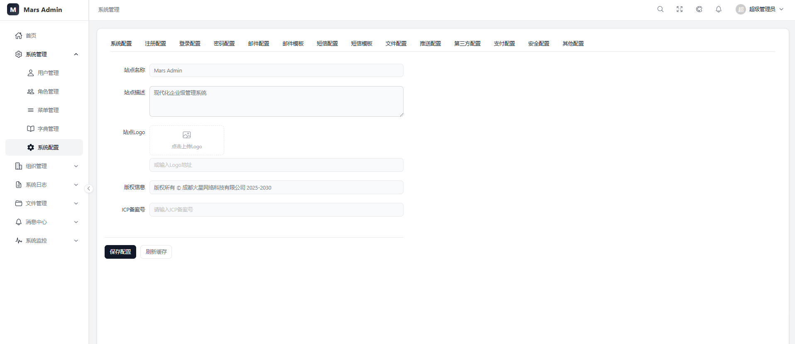
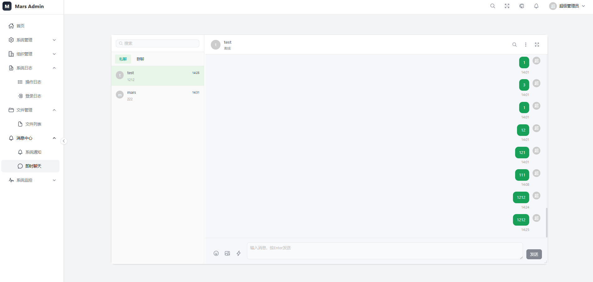
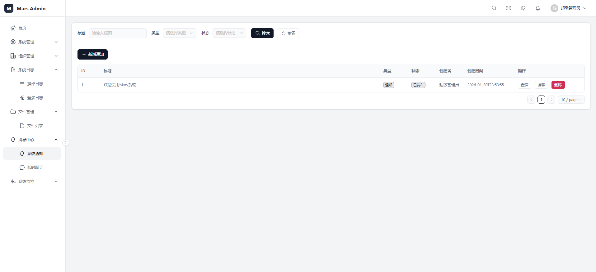
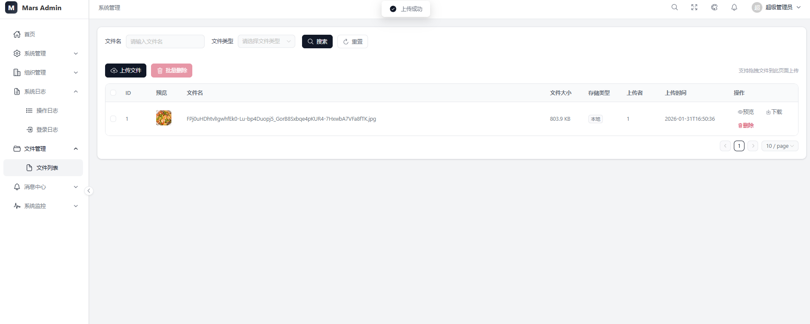

<div align="center">

# Mars Admin


**基于 Spring Boot 3 + Vue 3 的现代化后台管理系统**

[在线预览](https://marsadmin.mars-coder.cn/) · [开发文档](#开发指南) · [问题反馈](https://github.com/marsfactory/mars-system/issues)

</div>

## 在线演示

**演示地址：** [https://marsadmin.mars-coder.cn/](https://marsadmin.mars-coder.cn/)

| 账号 | 密码 | 说明 |
|------|------|------|
| admin | admin123 | 管理员账号（演示模式，部分操作受限） |

> 也可以自行注册账号体验完整功能

---

## 项目简介

Mars Admin 是一个开箱即用的企业级后台管理系统，采用前后端分离架构，提供完整的权限管理、系统监控、消息推送等功能。项目代码规范、结构清晰，适合作为企业后台管理系统的基础框架。

## 技术栈

### 后端

| 技术 | 版本 | 说明 |
|------|------|------|
| Spring Boot | 3.2.2 | 基础框架 |
| MyBatis-Plus | 3.5.5 | ORM 框架 |
| Sa-Token | 1.37.0 | 权限认证框架 |
| Redis | 7.0+ | 缓存/会话存储 |
| MySQL | 8.0+ | 数据库 |
| Quartz | 2.3.2 | 定时任务框架 |
| Hutool | 5.8.25 | Java 工具类库 |
| MinIO | - | 对象存储（可选） |
| 阿里云 OSS | - | 对象存储（可选） |

### 前端

| 技术 | 版本 | 说明 |
|------|------|------|
| Vue | 3.4.15 | 前端框架 |
| Vite | 5.0.11 | 构建工具 |
| TypeScript | 5.3.3 | 类型安全 |
| Naive UI | 2.37.3 | UI 组件库 |
| Pinia | 2.1.7 | 状态管理 |
| Vue Router | 4.2.5 | 路由管理 |
| Axios | 1.6.5 | HTTP 客户端 |
| ECharts | 6.0.0 | 图表库 |

## 项目结构

```
mars-system
├── mars-admin          # 后台管理模块（启动入口）
│   └── controller      # 控制器层
├── mars-common         # 公共模块
│   ├── entity          # 基础实体
│   ├── exception       # 全局异常处理
│   ├── result          # 统一响应封装
│   └── util            # 工具类
├── mars-system-core    # 系统核心模块
│   ├── entity          # 实体类
│   ├── mapper          # MyBatis Mapper
│   ├── service         # 服务层
│   │   ├── pay         # 支付服务（策略工厂模式）
│   │   ├── push        # 推送服务（策略工厂模式）
│   │   ├── sms         # 短信服务（策略工厂模式）
│   │   └── storage     # 文件存储（策略工厂模式）
│   └── config          # 配置类
├── mars-job            # 定时任务模块
│   ├── entity          # 任务实体
│   ├── service         # 任务服务
│   └── util            # Quartz 工具类
├── mars-ui             # 前端项目
│   ├── api             # API 接口
│   ├── components      # 公共组件
│   ├── layout          # 布局组件
│   ├── router          # 路由配置
│   ├── stores          # 状态管理
│   ├── utils           # 工具函数
│   └── views           # 页面组件
└── sql                 # 数据库脚本
```

## 功能特性

### 系统管理
- **用户管理** - 用户的增删改查、角色分配、状态管理
- **角色管理** - 角色的权限配置、菜单分配、数据权限
- **菜单管理** - 菜单的增删改查、权限标识配置
- **部门管理** - 组织架构管理、树形结构展示
- **岗位管理** - 岗位的增删改查
- **字典管理** - 数据字典维护、字典项管理
- **系统配置** - 系统参数的动态配置（分组管理）

### 系统监控
- **在线用户** - 当前在线用户查看、强制下线
- **定时任务** - Quartz 任务调度、执行日志
- **服务监控** - 服务器 CPU、内存、JVM 信息
- **缓存监控** - Redis 缓存信息、键值管理

### 日志管理
- **登录日志** - 用户登录记录、登录地点
- **操作日志** - 用户操作记录、AOP 切面自动记录

### 消息中心
- **系统公告** - 公告发布、已读未读状态
- **即时通讯** - WebSocket 实时消息、私聊/群聊

### 文件管理
- **文件上传** - 支持本地/MinIO/阿里云OSS/腾讯云COS
- **文件管理** - 文件列表、预览、下载、删除

### 安全特性
- **验证码** - 图片验证码、滑块验证码、短信验证码
- **接口加密** - RSA 非对称加密传输
- **登录安全** - 登录失败限制、账号锁定
- **权限控制** - 基于 RBAC 的细粒度权限控制

### 扩展功能
- **短信服务** - 支持阿里云/腾讯云短信（策略工厂模式）
- **支付服务** - 支持微信支付/支付宝（策略工厂模式）
- **推送服务** - 支持极光/友盟/个推（策略工厂模式）

## 系统截图

### 登录页面


### 控制台首页


### 用户管理


### 系统配置


### 即时聊天


### 系统通知


### 文件管理


### 服务监控


## 快速开始

### 环境准备

- JDK 17+
- Maven 3.8+
- MySQL 8.0+
- Redis 7.0+
- Node.js 18+

### 后端启动

1. **克隆项目**
```bash
git clone https://github.com/marsfactory/mars-system.git
cd mars-system
```

2. **初始化数据库**
```bash
# 创建数据库
CREATE DATABASE mars_system DEFAULT CHARACTER SET utf8mb4;

# 导入 SQL
mysql -u root -p mars_system < sql/mars_system.sql
```

3. **修改配置**

修改 `mars-admin/src/main/resources/application.yml` 中的数据库和 Redis 配置。

4. **启动项目**
```bash
mvn clean install
cd mars-admin
mvn spring-boot:run
```

后端默认运行在 `http://localhost:8080`

### 前端启动

```bash
cd mars-ui
npm install
npm run dev
```

前端默认运行在 `http://localhost:5173`

### 默认账号

| 账号 | 密码 | 说明 |
|------|------|------|
| admin | admin123 | 超级管理员 |

> 支持自行注册账号体验

## 系统截图

<details>
<summary>点击查看截图</summary>

### 登录页面
支持三种登录页面样式：经典左右分栏、全屏背景、毛玻璃效果

### 控制台首页
包含统计数据、快捷入口、更新日志、系统信息等

### 用户管理
用户列表、添加用户、编辑用户、分配角色

### 角色管理
角色列表、菜单权限分配

### 系统配置
分组式配置管理，支持系统、登录、注册、邮件、短信、文件、支付等配置

</details>

## 配置说明

### 文件存储配置

系统支持多种文件存储方式，通过系统配置动态切换：

- **本地存储** - 默认方式，文件存储在服务器本地
- **MinIO** - 分布式对象存储
- **阿里云 OSS** - 阿里云对象存储服务
- **腾讯云 COS** - 腾讯云对象存储服务

### 短信服务配置

- **控制台输出** - 开发测试使用，验证码打印到控制台
- **阿里云短信** - 阿里云短信服务
- **腾讯云短信** - 腾讯云短信服务

### 支付服务配置

- **微信支付** - 微信支付 API v3
- **支付宝** - 支付宝开放平台

## 开发指南

### 添加新模块

1. 在 `mars-system-core/entity` 下创建实体类
2. 在 `mars-system-core/mapper` 下创建 Mapper 接口
3. 在 `mars-system-core/service` 下创建 Service 接口和实现
4. 在 `mars-admin/controller` 下创建 Controller

### 添加操作日志

使用 `@Log` 注解自动记录操作日志：

```java
@Log(title = "用户管理", businessType = BusinessType.INSERT)
@PostMapping
public Result<Void> add(@RequestBody SysUser user) {
    // ...
}
```

### 添加权限控制

使用 Sa-Token 注解进行权限控制：

```java
@SaCheckPermission("system:user:add")
@PostMapping
public Result<Void> add(@RequestBody SysUser user) {
    // ...
}
```

## 更新日志

### v1.0.0 (2026-01-29)
- 新增文件存储策略工厂（本地/MinIO/OSS）
- 新增推送服务策略工厂（极光/友盟/个推）
- 新增短信服务策略工厂（阿里云/腾讯云）
- 新增支付服务策略工厂（微信/支付宝）
- 完善系统配置分组管理
- 优化登录页面（三种样式）
- 新增滑块验证码（弹窗拼图模式）

### v0.9.0 (2026-01-25)
- 完成字典管理和系统配置功能
- 实现部门和岗位管理
- 新增即时通讯功能（WebSocket）
- 优化前端界面和交互体验

### v0.8.0 (2026-01-20)
- 搭建项目基础框架
- 集成 Sa-Token 实现认证授权
- 完成前后端基础架构搭建
- 实现基础权限管理（用户、角色、菜单）

## 贡献指南

1. Fork 本仓库
2. 创建特性分支 (`git checkout -b feature/AmazingFeature`)
3. 提交更改 (`git commit -m 'Add some AmazingFeature'`)
4. 推送到分支 (`git push origin feature/AmazingFeature`)
5. 创建 Pull Request

## 开源协议

本项目基于 [MIT License](LICENSE) 开源。

## 联系作者

- **GitHub**: [@marsfactory](https://github.com/marsfactory)
- **Email**: mars@example.com

---

<div align="center">

**如果这个项目对你有帮助，请给一个 ⭐ Star 支持一下！**

</div>
